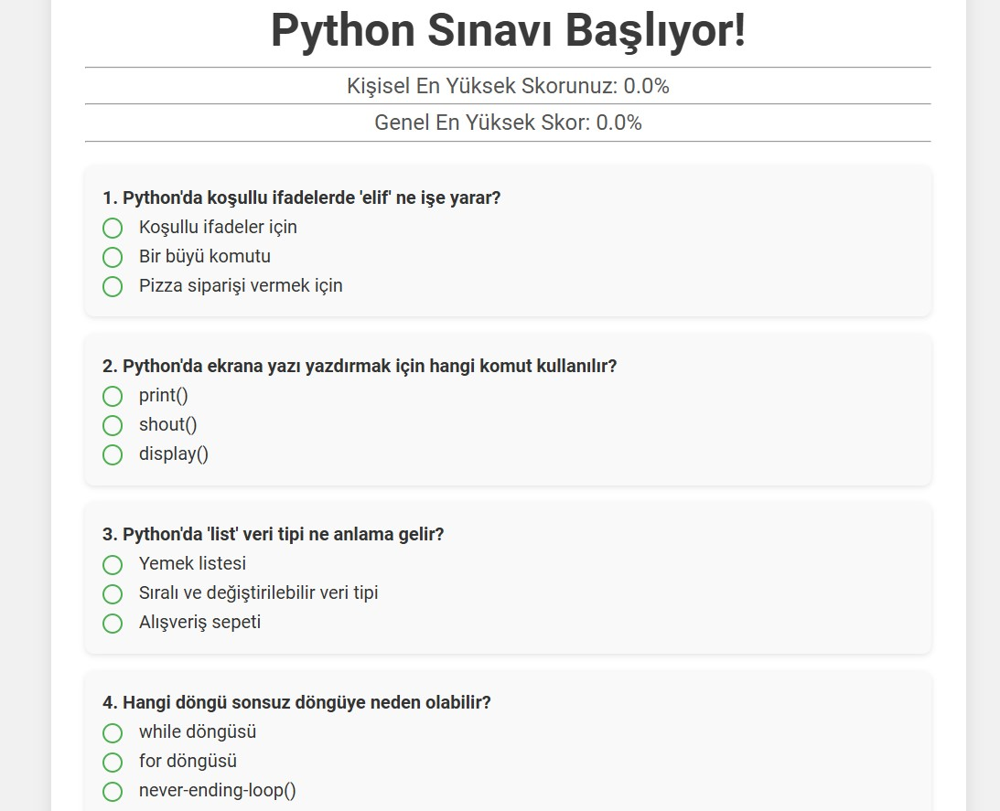
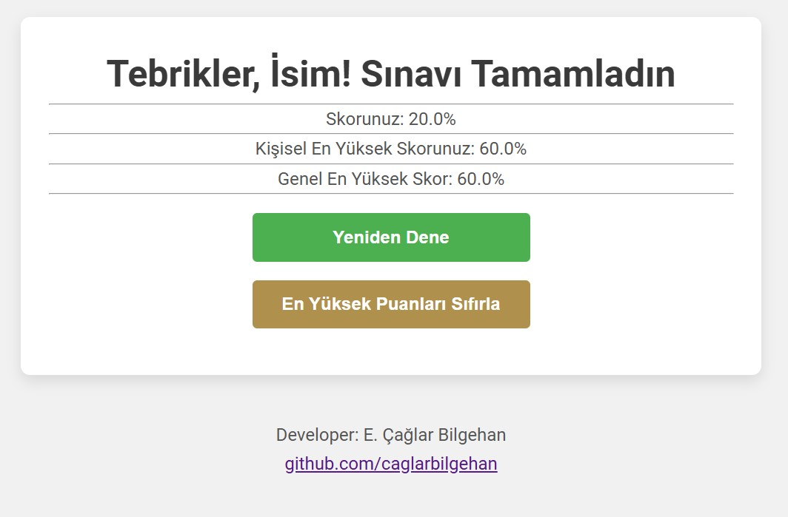

# Python-Flask-Quiz-App

🎉 **A Fun Quiz with Python!** 🎉 
This project is a simple and fun quiz application developed using Python and Flask. Users can answer the questions, see their scores, and track the highest score. The app also provides an option to reset the highest score.

## Features
- 📝 Multiple-choice questions
- ✅ Score calculation based on correct answers
- 🏆 Save and display the highest score
- 🔄 Reset the highest score
- 🎨 Simple and user-friendly interface

## Installation

Follow these steps to run this project on your local machine:

### Requirements
- Python 3.x
- Flask

### Steps
```bash
# 1. Clone the repository:
git clone https://github.com/caglarbilgehan/Python-Flask-Quiz-App.git

# 2. Navigate to the project directory:
cd Python-Flask-Quiz-App

# 3. Install the required Python libraries:
pip install flask

# 4. Start the application:
python app.py

# . Open the following URL in your browser:
http://127.0.0.1:5000
```

## Usage
- Answer the questions and click the "Submit" button.
- See your score and the highest score on the results page.
- Click the "Reset Highest Score" button to clear all scores.
- Start a new quiz by clicking the "Start New Quiz" button.

## Video Demo

[](https://youtu.be/Em_GhfFaUdU)


## Screenshots
### Home Page


### Results Page


## Project Structure
```
Python-Flask-Quiz-App/
├── app.py             # Main application file
├── quiz.db            # SQLite database
├── templates/
│   ├── quiz.html      # Quiz page
│   ├── result.html    # Results page
└── static/
    └── styles.css     # (Optional) Stylesheet
```

## Contributing
All contributions and feedback are welcome! Please make sure to open an issue before submitting a pull request. 🎉

## Contact
If you have any questions or suggestions about this project, feel free to contact me:  
📧 Email: [caglar@bilgehan.biz](mailto:caglar@bilgehan.biz)  
💻 GitHub: [caglarbilgehan](https://github.com/caglarbilgehan)

---

Thank you and have fun! 🎉